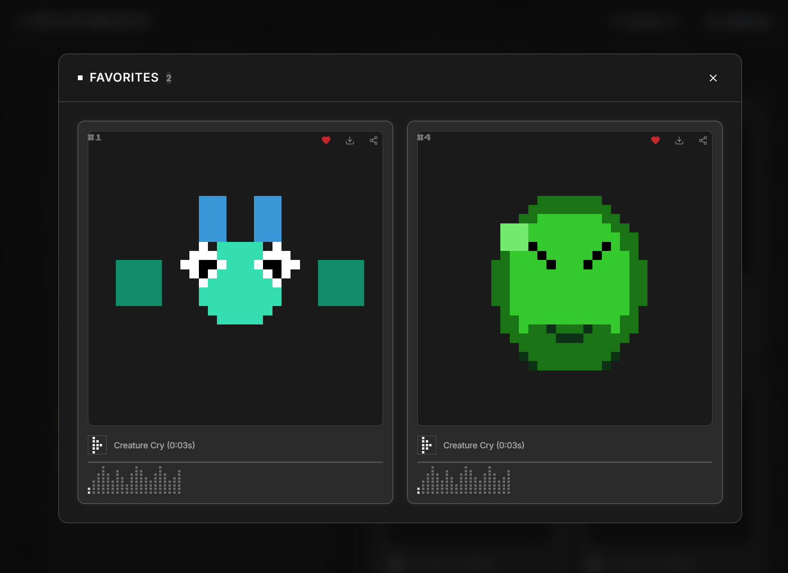

  # Pixel Creature Generator (PCG)

An AI-powered pixel art creature generator that helps you create unique pixel art creatures effortlessly.

## 🌐 Live Demo

Visit: [https://jake-yutong.github.io/Pixel-Creature-Generator-PCG-/](https://jake-yutong.github.io/Pixel-Creature-Generator-PCG-/)

## 📸 Screenshots

### Main Interface


### Generation Results


### Favorites Management


### Light Theme


## ✨ Features

- **🎨 AI Creature Generation**: Generate unique pixel creatures from text descriptions (e.g., "slime monster, glowing eyes, 3 horns")
- **🖼️ Reference Image Upload**: Upload reference images to guide creature design generation
- **📐 Pixel Size Options**: Support for 32px, 64px, and 128px pixel sizes
- **🔢 Batch Generation**: Generate 1-100 creatures at once for efficient creation
- **❤️ Favorites Management**: Save and manage your favorite creatures
- **🎯 Generation Control**: Pause, resume, and regenerate functionality
- **🌓 Theme Toggle**: Support for both dark and light theme modes
- **💾 Asset Export**: Download generated pixel creature images

## 🚀 Getting Started

Install dependencies:

```bash
npm i
```

Start development server:

```bash
npm run dev
```

Build for production:

```bash
npm run build
```

## 🛠️ Tech Stack

- React + TypeScript
- Vite
- Tailwind CSS
- Radix UI
- Lucide Icons

## 📄 License

This project is based on a Figma design. Original design: [Minimalist Desktop UI Screen](https://www.figma.com/design/S4lXoOURyPTZKvCn6PoMz0/Minimalist-Desktop-UI-Screen)
  